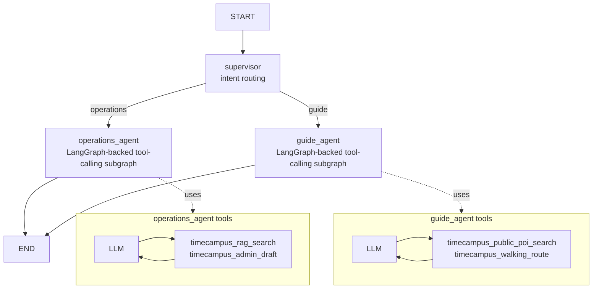
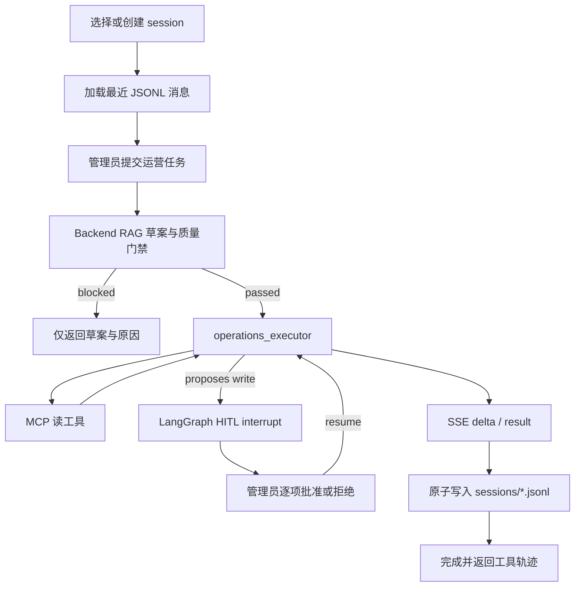

# TimeCampus LangGraph Agent

本文记录 `TimeCampus-Agent` 的 LangGraph 重构：一个 supervisor 路由入口，两个专业智能体子图，分别服务后台运营维护和游客导引。

## 参考实现

- LangGraph Graph API：官方文档把 agent workflow 建模为 `State`、`Nodes`、`Edges`，并要求编译后运行；本模块采用显式 `StateGraph`。
- LangGraph workflows：官方 orchestrator-worker 模式强调由 orchestrator 拆解、委派并汇总；本模块用更轻的 supervisor 路由，因为当前只有运营和导览两个固定领域。
- LangChain MCP 文档：MCP tools 可暴露数据库/API 操作给 agent；TimeCampus 后端已有 Spring AI MCP Tools/Resources/Prompts，因此 Python 侧优先复用现有 Backend API/MCP。
- `langgraph-supervisor-py`：官方示例是中心 supervisor 协调多个专业 agent；本模块直接手写 supervisor，少引一个库。
- `langgraph-swarm-py`：swarm 适合多 agent 动态移交；当前只需固定运营会话历史，因此不增加 swarm 依赖。

## 运行入口

```powershell
cd TimeCampus-Agent
uv run timecampus-agent ask "检索主楼旧照并生成维护计划"
uv run timecampus-agent ask --agent operations "为主楼补充游客简介"
uv run timecampus-agent ask --agent guide "主楼到图书馆怎么走？"
```

`--agent auto` 为默认值，由 supervisor 根据用户问题分流；`operations` 和 `guide` 用于本地调试或强制指定子图。

## 状态

| 字段 | 类型 | 写入节点 | 作用 |
| --- | --- | --- | --- |
| `messages` | LangChain messages | 输入、子智能体 | 对话上下文，使用 LangGraph `MessagesState` reducer 追加/更新 |
| `active_agent` | `operations` / `guide` | `supervisor`、子智能体 | 当前选中的专业智能体 |
| `route_reason` | string | `supervisor` | 分流原因，便于调试 |

## 完整状态图



Portal 运营页使用独立的可恢复执行图：



## 分流规则

- 命中路线、步行、导览、游客、参观等关键词，或输入含 `name,lat,lng;...` 点位格式时，进入 `guide_agent`。
- 其他任务默认进入 `operations_agent`，覆盖 RAG 检索、内容巡检、草案、审核、索引和维护建议。
- 调试时 `--agent operations` 或 `--agent guide` 会跳过自动分流。

## 运营智能体

目标：后台内容运营、RAG grounding、审核/文案/索引维护和可审批执行。

工具：

- `timecampus_rag_search`：检索 POI、影像、评论和维护规范。
- `timecampus_admin_draft`：调用 Backend `/admin/agent/draft`，生成带质量门禁的维护草案。

安全规则：

- 先检索再建议。
- 不编造年份、地点、来源、版权、人物或后端 ID。
- MCP 读工具自动执行；创建、更新、导入、审核、驳回和索引写操作必须 HITL 审批。
- 删除 POI、删除影像工具不加载；版权不明、来源不足或事实冲突时只输出人工复核计划。
- 本地使用 `InMemorySaver`；服务重启后待审批线程失效并要求重新运行。
- 会话消息使用本地 JSONL 持久化，服务重启后可继续同一上下文；`MEMORY.md` 提供人工维护的长期运营约束。
- LLM 消息通过 SSE `delta` 事件流式返回，质量门禁和审批边界不因此绕过。

## 游客导引智能体

目标：面向游客的 POI 查询、步行路线和导览说明。

工具：

- `timecampus_public_poi_search`：调用公开 `/api/v1/pois`，根据名称查已上架 POI。
- `timecampus_walking_route`：调用公开 `/api/v1/map/walking-route`，为 2-8 个 GCJ-02 点位规划步行路线。

安全规则：

- 点位少于 2 个、多于 8 个或坐标非法时不调用路线工具。
- 只有名称没有坐标时，先查公开 POI；仍不明确则请求用户补充。
- 回答保持游客可执行，不暴露后台 token、RAG 细节或管理端操作。

## 本地调试

```powershell
uv run pytest
uv run ruff check .
uv run timecampus-agent eval run --suite all --mode fixture --report-dir eval-reports --min-pass-rate 0.85 --min-overall 80
uv run timecampus-agent serve
```

Backend/MCP 启动后可做 live 调试：

```powershell
uv run timecampus-agent mcp-tools
uv run timecampus-agent ask --agent operations "检索主楼旧照并生成维护计划"
uv run timecampus-agent ask --agent guide "主楼,39.981,116.34;图书馆,39.982,116.341"
```

## Sources

- [LangGraph Graph API](https://docs.langchain.com/oss/python/langgraph/graph-api)
- [LangGraph Workflows and agents](https://docs.langchain.com/oss/python/langgraph/workflows-agents)
- [LangChain MCP docs](https://docs.langchain.com/oss/python/langchain/mcp)
- [LangChain Human-in-the-loop](https://docs.langchain.com/oss/python/langchain/human-in-the-loop)
- [langgraph-supervisor-py](https://github.com/langchain-ai/langgraph-supervisor-py)
- [langgraph-swarm-py](https://github.com/langchain-ai/langgraph-swarm-py)
