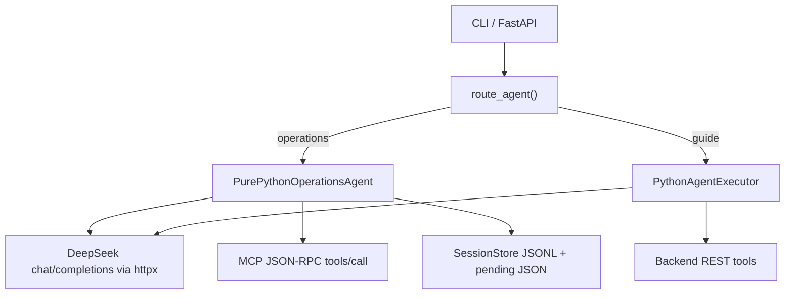
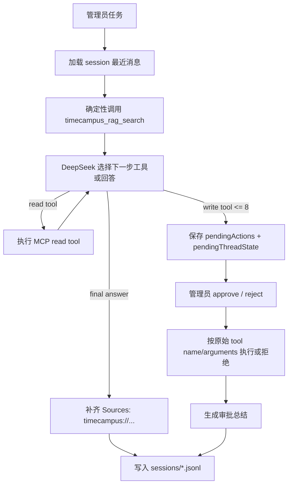

# TimeCampus Python Agent

本文记录 `TimeCampus-Agent` 的纯 Python Agent runtime。

## 运行入口

```powershell
cd TimeCampus-Agent
uv run timecampus-agent ask "检索主楼旧照并生成维护计划"
uv run timecampus-agent ask --agent operations "为主楼补充游客简介"
uv run timecampus-agent ask --agent guide "主楼到图书馆怎么走？"
uv run timecampus-agent serve
```

`--agent auto` 为默认值，由 `route_agent()` 根据用户问题分流；`operations`
和 `guide` 用于本地调试或强制指定执行器。

## Runtime 架构



核心模块：

- `llm.ChatClient`：用 `httpx` 调用 OpenAI-compatible `/chat/completions`。
- `tools.ToolSpec`：本仓库自己的工具描述、JSON schema 和 async handler。
- `mcp_client.McpStreamableHttpClient`：直接调用 Backend `/mcp` 的
  `initialize`、`tools/list`、`tools/call`。
- `agent.PythonAgentExecutor`：普通工具调用循环，用于 CLI operations/guide。
- `operations_runtime.PurePythonOperationsAgent`：运营专用循环，内置 RAG-first、
  写操作暂停和审批恢复。
- `memory.SessionStore`：保存会话 JSONL、`MEMORY.md`、pending run 和 pending
  thread state。

## 分流规则

- 命中路线、步行、导览、游客、参观等关键词，或输入含 `name,lat,lng;...`
  点位格式时，进入 `guide`。
- 其他任务默认进入 `operations`，覆盖 RAG 检索、内容巡检、草案、审核、索引
  和维护建议。
- `--agent operations` 或 `--agent guide` 会跳过自动分流。

## 运营执行流



运营约束：

- 每个新运营 turn 先调用 `timecampus_rag_search`。
- 超过 4000 字的 bulk 输入只暴露 read-only tools。
- `timecampus_delete_poi` 和 `timecampus_delete_media` 不加载。
- 写工具只生成 `pendingActions`，审批前不执行。
- 单轮超过 8 个写工具调用会要求管理员分批。
- 最终 RAG 回答缺少 `Sources:` 时，从工具结果补原始 `timecampus://` URI。
- Pending 摘要写入 `pending-runs.json`，恢复状态写入
  `pending-thread-states.json`；状态缺失时返回 expired，要求重跑。

## 游客导引

游客执行器只暴露公开工具：

- `timecampus_public_poi_search`：查公开已上架 POI。
- `timecampus_walking_route`：为 2-8 个 GCJ-02 点位规划步行路线。

点位少于 2 个、多于 8 个或坐标非法时不调用路线工具；只有名称没有坐标时，
先查公开 POI，仍不明确则请求用户补充。

## Eval

Fixture 模式仍读取固定 trace，不访问网络。Live 模式使用同一套 Python runtime：

- maintenance：`PurePythonOperationsAgent + MCP tools`
- retrieval target：直接调用 `timecampus_rag_search`
- guide：`PythonAgentExecutor + Backend REST guide tools`

验收命令：

```powershell
uv run pytest
uv run ruff check .
uv run timecampus-agent eval run --suite all --mode fixture --repetitions 2 --report-dir eval-reports --min-pass-rate 0.85 --min-overall 80 --min-consistency 0.80
```
